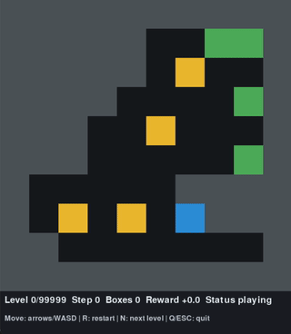
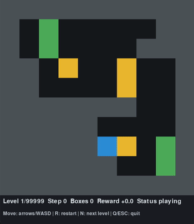
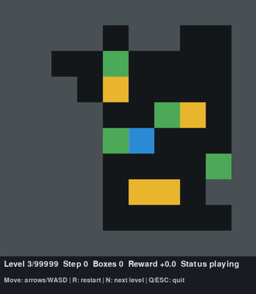

# boxoban

[](https://www.python.org/downloads/)
[](https://opensource.org/licenses/Apache-2.0)
[](https://gymnasium.farama.org/)

A [Gymnasium](https://gymnasium.farama.org/) environment for the [DeepMind Boxoban](https://github.com/google-deepmind/boxoban-levels) puzzle dataset. Boxoban is a simplified Sokoban variant designed for reinforcement learning research.

<p align="center">
  
  
  
</p>

## Features

- **High Throughput**: Optimized for fast simulation with minimal overhead
- **Native Gymnasium Support**: Works with `gym.make_vec()` for sync and async vectorization

## Quick Start

```python
import gymnasium as gym
import boxoban  # registers environment IDs on import

env = gym.make("Boxoban-hard-v0", disable_env_checker=True)
obs, info = env.reset(seed=0)
obs, reward, terminated, truncated, info = env.step(0)
```

### Vectorized Environments

```python
vec_env = gym.make_vec(
    "Boxoban-medium-train-v0",
    num_envs=128,
    vectorization_mode="sync",  # or "async"
    disable_env_checker=True,
)
```

## Installation

Clone with `--recursive` to include the [boxoban-levels](https://github.com/google-deepmind/boxoban-levels) submodule:

```bash
git clone --recursive https://github.com/YOUR_USERNAME/boxoban-gym.git
cd boxoban-gym
pip install -e .
```

If you already cloned without `--recursive`, initialize the submodule manually:

```bash
git submodule update --init --recursive
```

### Optional: pygame for interactive play

```bash
pip install pygame
```

## Registered Environment IDs

| Environment ID | Level Set | Split | Levels |
|---------------|-----------|-------|--------|
| `Boxoban-hard-v0` | hard | - | 3,332 |
| `Boxoban-medium-train-v0` | medium | train | 450,000 |
| `Boxoban-medium-valid-v0` | medium | valid | 5,000 |
| `Boxoban-unfiltered-train-v0` | unfiltered | train | 900,000 |
| `Boxoban-unfiltered-valid-v0` | unfiltered | valid | 10,000 |
| `Boxoban-unfiltered-test-v0` | unfiltered | test | 1,000 |

## Environment Details

### Observation Space
- Shape: `(10, 10, 3)` uint8

### Action Space
- `Discrete(4)`: 0=up, 1=down, 2=left, 3=right

### Rewards
| Event | Reward |
|-------|--------|
| Each step | `-0.1` |
| Box pushed onto target | `+1.0` |
| Box pushed off target | `-1.0` |
| All boxes on targets (solved) | `+10.0` |

### Episode Termination
- Terminated: All boxes on targets
- Truncated: Max steps reached (default: 120)

## Dataset Path Resolution

Level files are located in this order:

1. `level_root` argument in `gym.make(...)`
2. `BOXOBAN_LEVELS_DIR` environment variable
3. `./boxoban-levels` in current directory
4. Repository-relative `boxoban-levels`

## Benchmarks

Measure throughput on your hardware:

```bash
python benchmarks/throughput.py --env-id Boxoban-medium-train-v0 --num-envs 128 --steps 2000
```

Example output:
```
single env-steps/s: 85,000
sync   env-steps/s: 420,000
async  env-steps/s: 380,000
```

## Play Interactively

Play levels manually using `play.py`:

```bash
python play.py --level-set hard
```

**Controls:** Arrow keys/WASD, R (restart), N (next), Q/ESC (quit)

```bash
# More options
python play.py --level-set medium --split valid
python play.py --level-set hard --level-idx 42
```

## Acknowledgments

- Level data from [DeepMind Boxoban Levels](https://github.com/google-deepmind/boxoban-levels) (Apache 2.0 License)
- Original Sokoban game by Hiroyuki Imabayashi (1981)

## License

Apache License 2.0 — see [LICENSE](LICENSE) for details.
